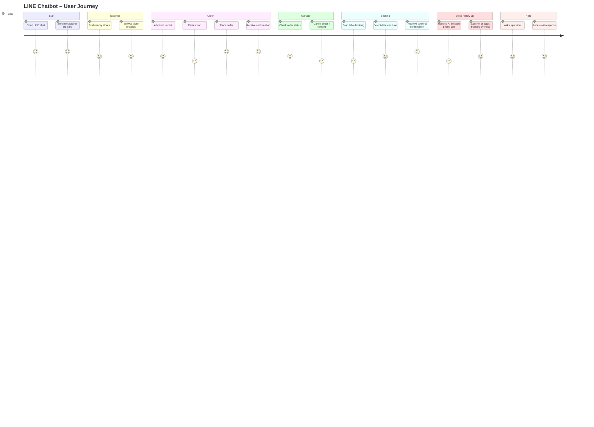
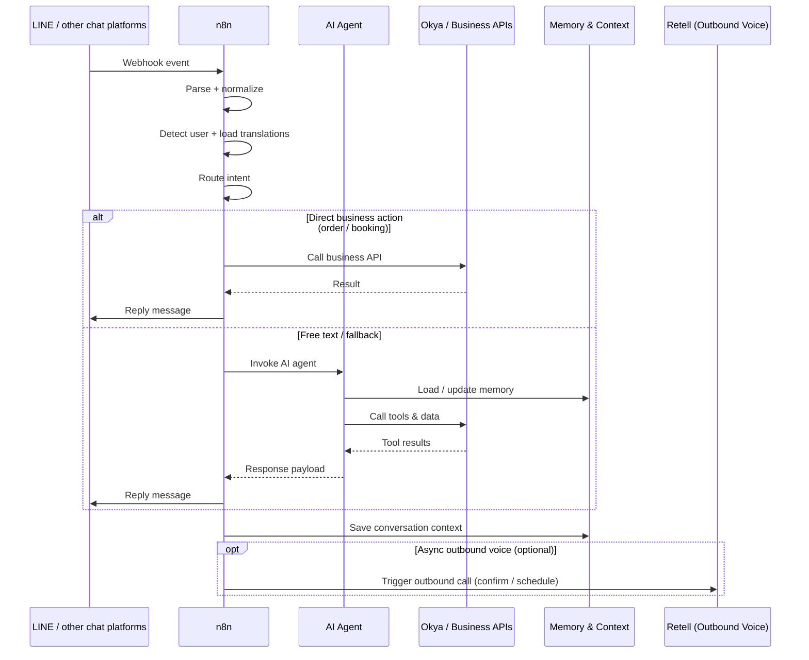
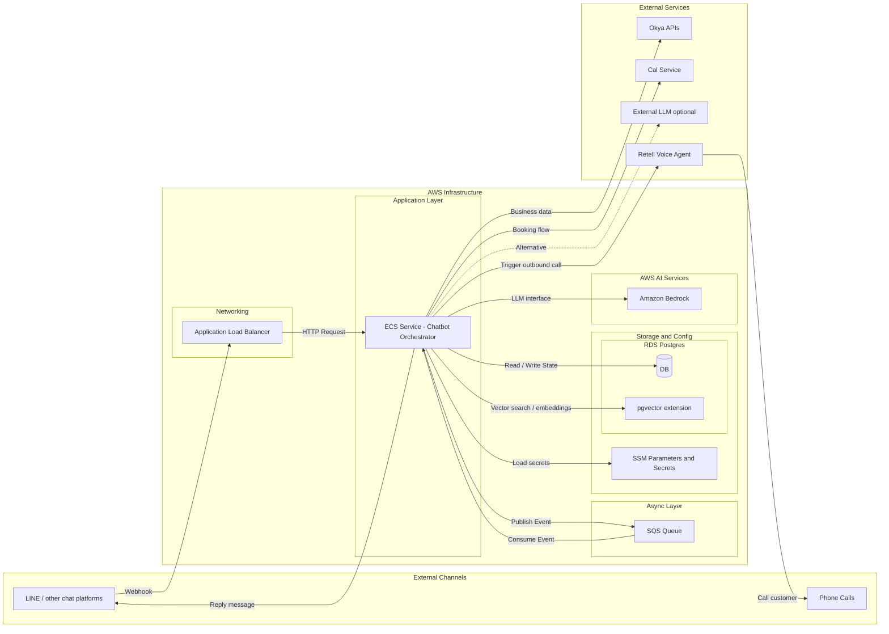
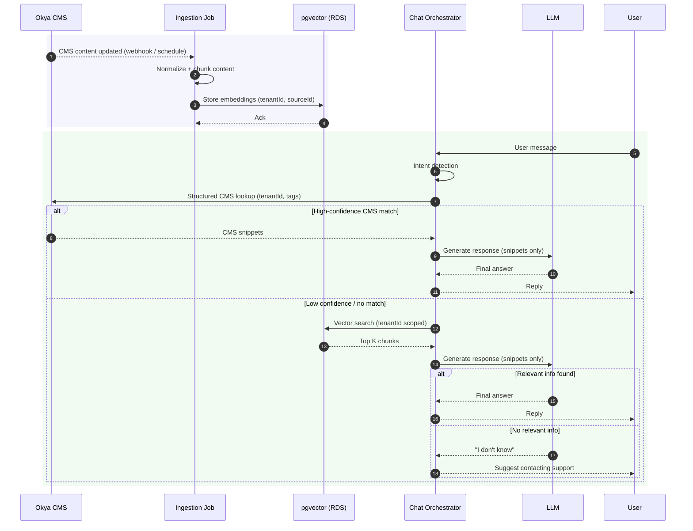

## Unified Chat, Booking, and Voice Orchestration on AWS

A Monolithic-First, Domain-Driven Approach

## Summary

This document defines the next evolution of our chatbot platform: a **code-first, AWS-based orchestration architecture** built around a **single ECS-based orchestrator**.

We will default to:
- ECS for orchestration
- SQS for async workflows and retries
- RDS + pgvector for state and knowledge
- Amazon Bedrock for LLM reasoning

Voice support in the current scope is **AI-initiated outbound calls only** (via Retell).  
A full inbound call-center model is **out of scope**.

This document is intended to align on the default architecture for the next phase of the chatbot platform. The system is designed to support multiple chat platforms, with LINE as the first concrete integration.

## Decision to align on:

Adopt an **ECS-based, queue-driven orchestration architecture** as the default path forward, with n8n treated as an optional, transitional edge component rather than the system of record.

## Current State

- Chatbot implemented using **n8n workflows**
- Integrated with:
  - LINE Official Account
  - Okya APIs (business data)
  - Supabase (conversation state)
  - Cal.com (booking)
  - **Retell** (AI-initiated outbound voice calls for booking confirmation or scheduling)
- Setup is **functional**, but introduces:
  - Multi-tenancy challenges
  - Collaboration and permission limits
  - Manual versioning and rollback
  - Friction as LLM workflows evolve

## Key Observations

1. **Chatbots are event-driven**
   - LINE webhooks trigger async processing and side effects
   - Queues are a more reliable option than visual workflows

2. **Multi-tenancy**
   - Each business must be fully isolated
   - Tenancy needs to be explicit (`tenantId` everywhere)

3. **LLM workflows**
   - Prompts, retrieval logic, tools, and evaluation change often
   - These should live in Git rather than a UI

4. **Operational clarity**
   - Deterministic retries
   - Better observability
   - Easier debugging and rollback

5. **Team scale**
   - Multiple engineers need to work safely in parallel
   - Code-based workflows support reviews and environments better

## Key Architecture Decisions

This is a modular monolith with clear domain boundaries, not a long-term commitment against future extraction.

| Decision            | Chosen Option            | Rationale                                                  | Deferred Alternatives   |
| ------------------- | ------------------------ | ---------------------------------------------------------- | ----------------------- |
| Orchestration model | ECS                      | Aligns with existing infra templates; lowest delivery risk | Lambda-based serverless |
| Async backbone      | SQS                      | Predictable retries, DLQ, AWS-native                       | EventBridge             |
| LLM provider        | Amazon Bedrock (default) | IAM, VPC, predictable ops                                  | OpenAI (fallback)       |
| Voice               | Retell (outbound only)   | Matches current capability; avoids telephony complexity    | Amazon Connect          |
| Vector store        | pgvector (RDS)           | Simplicity, shared infra                                   | OpenSearch              |

## User Journey



This represents the user-facing experience the system is optimizing for.

## Current System Sequence



Shows how events flow through the system today, with n8n acting as the primary orchestrator.

## Proposed Direction

- Introduce a **code-based orchestrator** responsible for routing, state management, and LLM invocation
- Use **SQS** to decouple ingress from processing and handle retries and async side effects
- Keep channel integrations thin and stateless
- Retain existing workflows only where they reduce short-term delivery risk

In this setup, core business logic, state transitions, and AI workflows live in code.

## Phased migration plan (Incremental)

### Phase 0 - Current (Now)
- n8n handles orchestration
- Chat + booking + outbound voice functional

### Phase 1 - Core Orchestrator (January)
- ECS orchestrator introduced
- LINE webhooks routed to ECS
- n8n remains for non-critical flows

### Phase 2 - Domain Migration
- Move chat routing + booking logic into code
- Retain n8n only for legacy or low-risk flows

### Phase 3 - Optional Cleanup
- Evaluate removing n8n entirely
- Extract domains if scale demands it

## Infra model



## Tenancy Model

**Tenant = the business using the chatbot for their customers**

- One tenant per business / brand
- One LINE Official Account per tenant
- Each tenant owns:
  - Products, stores, promotions
  - Chatbot behavior and configuration
  - Conversation state and data

Infrastructure is shared; **behavior and data are isolated**.

```
Platform
├─ Tenant A (Business)
│   ├─ Customer 1
│   ├─ Customer 2
│   └─ Customer N
├─ Tenant B (Business)
│   ├─ Customer 1
│   ├─ Customer 2
│   └─ Customer N
```

## CMS Knowledge, Embeddings, and Retrieval



## Clarifying current call booking scope

Based on the current n8n setup, here’s how voice and booking are supported today:

- We support **chat-based booking via LINE**  
  (availability lookup, reservation, reschedule, cancel).

- We also support **AI-initiated outbound calls**  
  where the system triggers a call to the customer (e.g. to confirm or schedule a booking), currently using **Retell**.

- We **do not** support a full call-center / hotline model yet  
  (no inbound calls, IVR menus, or live agent routing).

So when we say **call booking today**, it means:
- Booking flows are initiated from **chat or system events**
- Voice is used only for **AI-driven outbound calls**
- This is **not** a traditional inbound call-center setup

### Notes on future scope (if needed)

- Inbound voice (customers calling a number) is **out of scope today**
- Supporting that would require additional components and a slightly different setup
- Possible options later:
  - **Amazon Connect + Polly + Transcribe**
  - Or continuing with a CPaaS like **Retell / Twilio**
- This can be introduced as a **separate domain**, without changing the core orchestrator architecture


## SQS Use cases

- **Webhook burst protection**
  - Absorb spikes from LINE webhooks without overloading the orchestrator
  - Keep ingress fast and resilient

- **Async side effects**
  - Handle non-blocking tasks like booking follow-ups, outbound call triggers (Retell), logging, and notifications
  - Improve perceived chat response time

- **Retries and failure handling**
  - Safely retry failed interactions with Okya, Cal, LLMs, or voice services
  - Use DLQ for visibility and debugging of hard failures

- **Domain separation**
  - Isolate workloads such as chat events, booking flows, and voice call triggers
  - Prepare for future domain-level scaling or extraction without restructuring the app
  
## Bedrock

For LLM reasoning, the orchestrator integrates via the Amazon Bedrock client, allowing us to evaluate and switch between any Bedrock-supported models: https://docs.aws.amazon.com/bedrock/latest/userguide/models-supported.html

Bedrock doesn't give us OpenAI's proprietary GPT models.  It gives us GPT-style open-weight models that AWS hosts, plus other providers like Claude and Titan.  The benefit is we can stay AWS-native while still using modern LLMs, and keep the option to use OpenAI externally if needed.

| Area                  | Option                                    | Typical Latency         | Notes                                                                 |
| --------------------- | ----------------------------------------- | ----------------------- | --------------------------------------------------------------------- |
| Chat LLM              | Amazon Bedrock (Claude / gpt-oss / Titan) | ~400 ms – 3 s           | Runs inside AWS; predictable p95; IAM + VPC integration               |
| Chat LLM              | OpenAI (external API)                     | ~400 ms – 3 s           | Comparable model latency, but adds external network hop + rate limits |
| Voice (AI Calls)      | Retell (STT + TTS + Call Control)         | ~1 – 3 s                | Managed voice agent; abstracts telephony, STT, TTS, and turn-taking   |
| Business APIs         | Okya / Cal                                | Variable (200 ms – 2s+) | Often the dominant non-LLM latency; affected by retries and load      |
| Database              | RDS (Postgres)                            | ~10 ms – 80 ms          | Region, connection pooling, and query shape matter                    |
| Vector Search         | pgvector (RDS)                            | ~20 ms – 150 ms         | Depends on index type, dimension size, and filtering                  |
| Chat Response (User)  | End-to-end                                | ~1.5 – 4 seconds        | LINE response time; user waits synchronously                          |
| Voice Call (Outbound) | Post-chat / async                         | Seconds–minutes later   | Triggered after chat or system event; not in chat critical path       |

## A note on latency

- External business APIs (e.g. Okya, Cal, Retell) can introduce additional latency depending on their response times.
- Network jitter and transient connectivity(short-lived, temporary network problems - Brief packet loss, DNS lookup delay) issues can affect end-to-end response time.

These are short-lived network variations that occasionally slow requests; queue-based and async design is meant to absorb them.

## Key Risks and Mitigations

| Risk                 | Impact             | Mitigation                        |
| -------------------- | ------------------ | --------------------------------- |
| External API latency | Slow responses     | Async via SQS, retries, timeouts  |
| Voice scope creep    | Architecture drift | Explicit outbound-only scope      |
| LLM cost variance    | Budget risk        | Bedrock default, usage caps       |
| Tenant data leakage  | High               | tenantId enforced at ingress + DB |


## Success Criteria

- No cross-tenant data leakage
- p95 chat response < 4s
- Outbound voice remains async and non-blocking
- No increase in operational incidents vs n8n baseline

## Non-goals

- No multi-agent LLM experimentation
- No real-time CMS to embedding sync
- No per-tenant custom models

## Outcome

This approach:

- Reduces operational risk
- Makes multi-tenancy explicit
- Allows the chatbot to evolve without locking us into current tooling

This allows us to ship safely while setting up a foundation that can support multiple businesses and evolving LLM workflows.